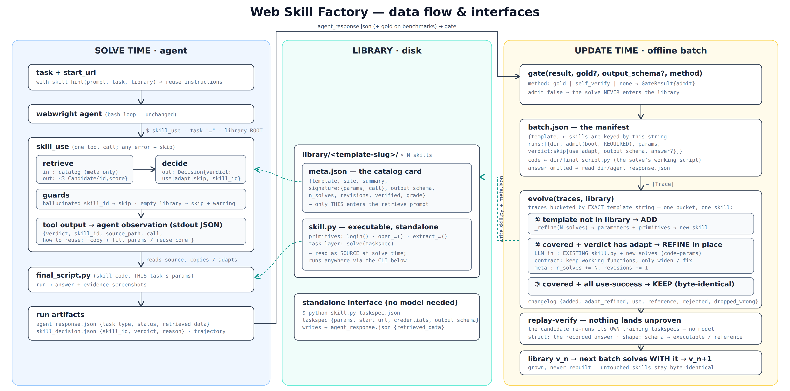

# Reference — verification, parameters, components

[← back to the module README](../../src/webwright/skill_factory/README.md)

## Verification and grades

Two gates check different things. The **input gate** decides whether a solve is trustworthy enough
to build from; the **output gate** decides whether the distilled skill actually runs. Each has
three levels:

| gate | what it asks | levels (strict → loose) | what it decides |
|---|---|---|---|
| **input** | is this solve's answer trustworthy? | `gold` (match a known answer) → `self_verify` (shape + non-empty + the agent's own "I succeeded"; passes wrong-but-plausible answers, so use `gold` when correctness matters) → `none` | whether a solve becomes **material** for a skill |
| **output** | can the skill reproduce the answer with no model? | `strict` (give back the recorded answer, ignoring spacing and case) → `shape` (non-empty + schema-shaped, for drifting answers) → `off` (no replay) | the skill's **grade**, below |

The output gate spends two nested budgets, `--draws` independent candidates each repaired up to
`--verify-rounds` rounds; if none reproduce the recorded answers, nothing lands.

**Both gates judge answers. One check judges the method.** A solve can hold a right answer and
still be nothing to build on:

```python
RESULT = ["UA 729", "United", "12:10 AM"]
if "UA 729" in text: return "UA 729"
```

It recognised its answer instead of working it out, and the input gate can't see that: the answer
is right, and the answer is all it looks at. Distillation may not copy instance values, so it
must invent an extractor the trace never had — and then fails replay on that instance, however
many draws you spend. So a solve whose script contains **every field of its answer verbatim** is
dropped before distilling, counted as `dropped_lookup`. (Every field *at once* — "the answer
appears in the code" flags working solves too, where an airline name is a vocabulary entry.)

Whichever level the output gate ran at becomes the skill's **grade**:

| | `executable` | `reference` (`--on-fail reference`) | `unverified` (`--verify off`) |
|---|---|---|---|
| what happened | replay ran and reproduced the answers | replay ran and it **failed** | **no replay ran** |
| what it buys | **run it directly**: plain python/playwright, no model, cron-able | a **prior for the agent**: exact selectors, URLs, param shapes it reads and reuses | the same prior, but untested: might run standalone, might be broken |
| trust | proved | **known** not to reproduce its answers | unknown |
| refining | incremental refines must pass **regression replay** (`replays.json`); a verified skill is never overwritten by an unverified refine | refined freely | refined freely |

`unverified` (`--verify off`) skips replay entirely. Use it when no replay could be fair: the site
needs credentials the library can't store, or the training instances themselves have expired (the
date has passed, the listing is gone), so the skill comes back with nothing and even `shape`
rejects it (an empty answer fails the gate) for something that isn't the skill's fault. Drifting
*values* are not that case; `shape` replays those and compares loosely. Nor is a page that moved:
there the failed replay is real news, and `--on-fail reference` (the default) keeps the broken
skill as a labelled prior; `--on-fail reject` instead lands nothing and leaves the runs retryable.
`reference` isn't a grade to aim for, but it's the default so a failed replay never leaves you
empty-handed; a clean run still lands `executable`.

Why code even at `reference` grade, versus a natural-language note: the selectors, URLs and param
shapes are verbatim-copyable into the agent's next script, individual primitives often still run
when the whole skill doesn't, and a reference skill is one repair away from executable. And a
prior alone pulls its weight: the WebArena numbers in
[Results](../../src/webwright/skill_factory/README.md#-results) come from a library the agent read
exactly this way. The flights skill in the
[Quick Start](../../src/webwright/skill_factory/README.md#-quick-start), by contrast, reruns an
unseen route standalone, which is what `executable` buys.

## All parameters
 
The commands fall into two modes (see [Manual mode](manual.md) for when to use which). **Quick
mode** covers `init`, `build`, and `learn`: it infers the template and parameters and gates each
solve for you. **Manual mode** is `update`: you hand it a manifest and state all of that yourself.
`skill_use` belongs to neither; it's the call the agent makes at solve time to query the library.
 
### Quick mode
 
#### `python -m webwright.skill_factory init "<need>"`
 
| flag | default | meaning |
|---|---|---|
| `-o`, `--out` | `skill.yaml` | where to write the drafted spec |
| `--rows` | 3 | how many blank instance rows to leave for you to fill (these become the `instances:` in the spec) |
 
One LLM call. Drafts the template, the `start_url` (a guess, check it), and the verify mode it
judges the task needs. Never the values.
 
#### `python -m webwright.skill_factory build <spec.yaml>`
 
Solves the spec's instances, then hands them to `learn`. Everything in the spec's `build:` block
can be overridden here; machine-specific things are flags only, so the spec stays committable.
 
| flag | default | meaning |
|---|---|---|
| `--library` | `library` | library directory to grow |
| `-c`, `--config` | (none) | webwright model config for the AGENT (repeatable). It reads a yaml, **not** the env vars |
| `--jobs` | 1 | solve N instances at once (solving only; `learn` is serial). More than you have means all of them |
| `--outputs` | `<spec dir>/build_outputs` | where solves are written; also what you point `learn` at to retry |
| `--dry-run` | off | print the plan (substituted tasks, policy, what would be solved) and stop |
| `--yes` | off | skip the confirmation before spending agent time |
| `--verify`, `--verify-rounds`, `--draws`, `--on-fail`, `--chunk`, `--golds` | from the spec's `build:` block, else `learn`'s defaults | override the spec |

On `--jobs`: the ceiling is the site, not the flag. Too many browsers from one IP gets you
throttled, which reads as your solves failing; 3 to 5 is safe. With N > 1 each solve goes to
`build_outputs/solve_NN.log` and progress ticks every 30 s.
 
#### `python -m webwright.skill_factory learn <runs_dir>`
 
| flag | default | meaning |
|---|---|---|
| `--library` | `library` | library directory to grow |
| `--golds` | (none) | JSON `{task_id: gold_answer}` → gold gate instead of self_verify |
| `--chunk` | 25 | runs per LLM grouping call |
| `--dry-run` | off | print the grouping plan, change nothing |
| `--verify` | `strict` | replay bar: `strict` = give the recorded answers back (spacing and case folded, so a label typed `AS 26` for a page that prints `AS26` can't sink a working skill), `shape` = non-empty + schema-shaped (live data), `off` = skip |
| `--verify-rounds` | 2 | repair rounds **within one candidate**: its failures are fed back and it is re-distilled |
| `--draws` | 2 | **independent** candidates before giving up. A draw can simply come out brittle, and a fresh one often lands where repairing the bad one won't. Stops at the first that verifies |
| `--on-fail` | `reference` | failed verification: `reference` (lands as a labeled prior; never overwrites an existing skill) or `reject` (lands nothing, runs stay retryable) |
 
### Manual mode
 
#### `python -m webwright.skill_factory.update`
 
The manifest-driven path (see [manual.md](manual.md)). Use it when you're assembling batches by
hand rather than from a spec.
 
| flag | default | meaning |
|---|---|---|
| `--manifest` | required | `{template, runs:[{dir, admit(bool, REQUIRED), params, verdict, site, output_schema, answer?, credentials?}]}` |
| `--library` | required | library directory |
| `--verify` / `--verify-rounds` / `--draws` / `--on-fail` | `off` / 2 / 2 / `reference` | as above. `--verify` is `off` by default here because benchmark sites may need credentials; `--verify-rounds` and `--draws` only take effect once you turn `--verify` on |
 
### Solve time
 
#### `python -m webwright.tools.skill_use`
 
The call the agent makes to query the library while solving a task. Ranking is local; the
verdict is one LLM round trip on the module's model (below).
 
| flag | default | meaning |
|---|---|---|
| `--task` | required | the task text to match against the library |
| `--library` | `$SKILL_LIBRARY_ROOT`, else `library` | library directory to query |
| `--output` | (none) | also write the JSON verdict here; it goes to stdout either way |
 
### Environment variables

#### Two models, two doors

`build` is `solve × N`, then `learn`. Each half runs a different model:

| | the agent's model | the module's model |
|---|---|---|
| what it does | **opens the browser**: looks at the page, picks the next click, and again, ~50 times per solve | **never opens a browser**: reads the finished transcripts and writes the skill's python |
| who calls it | the solves in `build`; any Webwright run | `learn`, plus `init` (drafts your spec) and `skill_use` ("can this skill help?") |
| which model | `model_name:` in a yaml you pass as `-c model.yaml` | `SKILL_MODEL_NAME`, else `OPENAI_MODEL`, else the class's fallback |
| what URL | `openai_endpoint:` in that yaml | `SKILL_MODEL_ENDPOINT`, else `OPENAI_ENDPOINT`, else the class's fallback |

Same class underneath (`models/openai_model.py`); `llm.py` just builds from env the config the
yaml spells out by hand. So `SKILL_MODEL_NAME` and `OPENAI_MODEL` aren't two settings: one field,
`SKILL_MODEL_*` wins. Two names exist so you can send distillation somewhere other than whatever
else already reads `OPENAI_*`; if you don't care, set only `OPENAI_*`.

Set neither of those and you get that class's own fallbacks, `gpt-4o` at `https://api.openai.com/v1/responses`,
and a line on stderr saying so. Those are inherited defaults, not suggestions: the
[Results](../../src/webwright/skill_factory/README.md#-results) ran on a much newer model, and
every skill in your library is written by whichever one you leave it on. Name it.

**The agent's model reads none of these vars**; nothing outside `llm.py` does. On a custom
gateway set both doors, or your solves go to `api.openai.com` while everything else uses your
gateway. `build` warns when only one is set.

| var | read by | meaning |
|---|---|---|
| `OPENAI_API_KEY` | **both models** | the key, and the one genuinely shared var |
| `OPENAI_ENDPOINT` | the module's model | custom gateway. **The FULL request URL**, e.g. `https://gateway.example/api/responses`, not `.../api`. A base path fails |
| `OPENAI_MODEL` | the module's model | which model the module's calls use |
| `SKILL_MODEL_ENDPOINT` | the module's model | the same setting as `OPENAI_ENDPOINT`, higher priority (above) |
| `SKILL_MODEL_NAME` | the module's model | the same setting as `OPENAI_MODEL`, higher priority (above) |
| `SKILL_MODEL_CLASS` | the module's model | a non-OpenAI backend. Defaults to `openai` |
| `SKILL_MODEL_TIMEOUT` | the module's model | seconds per call. Defaults to 600: distilling a skill emits ~16k tokens, and the model's own 120 s default cuts it off mid-file |
| `SKILL_LIBRARY_ROOT` | `skill_use` | default for `--library`, so the agent doesn't need the path in its prompt |
| `WORKSPACE_DIR` | every generated skill | where a skill writes `agent_response.json`, its log and screenshots. Defaults to the cwd, which is why the docs `cd` to a scratch dir before running one |
| `MODEL_CFG` | `examples/quickstart.sh` only | which yaml that script passes as the agent's model. `build` takes `-c` instead |

Using the module as a library rather than a CLI? `configure_llm(model)` hands it a model object
directly and every var above is ignored: that's how a running agent gives the module its own
backend, with no gateway or key hardcoded anywhere.

## Components
 
The module's files and what each one does, for anyone reading or extending the code.

The data flow between them, and the interface each one exposes:



 
| file | role |
|---|---|
| `library.py`  | `Skill` + `Library(root)`: on-disk skills (`<id>/skill.py` + `meta.json`) |
| `retrieve.py` | `retrieve(task, library)` → ranked `Candidate`s (relevance) |
| `decide.py`   | `decide(task, candidates)` → `Decision(verdict, skill_id, reason)` (utility: use/adapt/skip) |
| `gate.py`     | `gate(result, method=gold\|self_verify\|none)` → admit? (keeps wrong solves out) |
| `update.py`   | `evolve(traces, library)`: grow on the existing library (add / adapt-refine / keep); `_refine` parameterizes and decomposes into primitives, incrementally improving an existing skill |
| `llm.py`      | `configure_llm(model)` + `llm()`: **backend-agnostic** via Webwright's `Model` abstraction; a bare CLI builds the model from `SKILL_MODEL_NAME`/`SKILL_MODEL_ENDPOINT` (or `OPENAI_*`) env, no hardcoded endpoint/key |
| `prompt.py`   | `with_skill_hint(prompt, task, library)`: non-invasive task-prompt hint (manual reuse path) |
