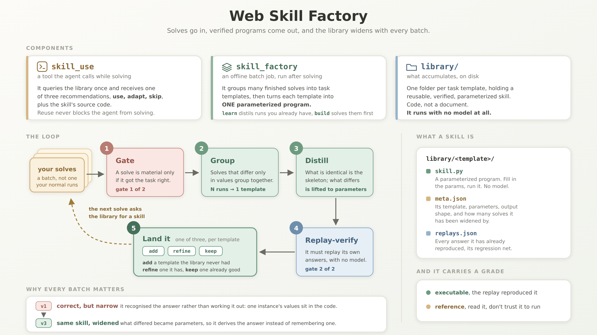

# Web Skill Factory

**Most agent skills are context the model refers to. Ours are programs.**
 
Every task Webwright solves leaves a working script behind. The Skill Factory turns those
scripts into a growing library of **reusable, verified, parameterized skills**: code you can
run without a model and compose into the next task instead of re-exploring the site.

## 🎥 Demo

https://github.com/user-attachments/assets/3f93fac4-bb93-4ea5-8b45-280ed1334feb


## ✨ Highlights
 
- 🏃 **Runs standalone, no model.** A learned skill is just code. It re-executes in ~40 s with zero tokens, so you can cron it to run every day, instead of having a model re-read a note and redo the work every time.
- 🛠️ **Has a real software-engineering surface.** Because skills are code, they inherit code's tools and properties for free: inheritance, polymorphism, encapsulation, tests, versioning, and history. A skill is executable and verifiable, not prose the model has to interpret.
- ✅ **Verified twice before it lands.** First an input gate: a solve only becomes material if it got the task right, so a wrong answer never feeds a skill. Then the distilled skill must replay its own answers standalone, with no model, so a broken skill can't slip in and poison the library.
- 🌱 **Gets stronger the more you use it.** New solves widen a skill in place, self-evolving as you go. Regression-replay keeps old coverage from breaking, so a skill that's already been verified is never damaged by a later change.


## How it compares
 
|  | published `SKILL.md`| SkillOpt | OpenCLI | **Web Skill Factory (Ours)** |
|---|---|---|---|---|
| a skill **is** | a document the model reads | a document the model reads | one CLI command per site capability | **a parameterized Python program that runs on its own, no model** |
| **domain / whose need** | anything, but nothing runs | general agent tasks (ALFWorld, DocVQA, spreadsheets, math...) | web: a site's common capabilities, shared by all users | **web: the specific task *you* repeat, including private, cross-site, multi-step workflows no shared catalogue has** |
| **produced by** | a person writes and publishes it; you install it | edits to one document, driven by past runs | a person or agent writes one per site | **distilling several solves of the same task template** |
| **parameters come from** | whoever wrote it | none | the author declares them | **the differences actually observed between your solves** |
| **verified?** | no | one gate: scores higher on a held-out split | one gate: checked when it's first written, plus live tests | **two gates: a wrong answer never feeds a skill, *and* the skill must reproduce its own answers standalone, no model** |
| agent can **adapt** it | read-only | read-only | it edits the source only to repair the shared adapter when it breaks — never to fit the task in front of it | **yes, per task: the source is in hand, to copy or to rework as the task needs — the library is left alone** |
| **grows from your runs** | no, it's whatever its author last wrote | yes, but what grows is a document for a frozen agent, not a program | no; a broken adapter is patched back to what it did, and nothing accumulates from your runs | **yes: each new solve widens it in place, regression-replayed so old coverage can't break** |

## 🗺️ How it works



```
solve → gate → group by template → distill → replay-verify → library → next solve reuses
```

At solve time the agent asks the library once and gets `use` / `adapt` / `skip` — its stated
intent for the skill, after which it has the source and reuses it as the task needs. Reuse never
blocks solving. Two touch points into Webwright, no agent-loop changes:

- **reuse**, at solve time: the `skill_use` tool — the agent invokes it from bash like any other
- **growth**, afterwards: the `skill_factory` CLI — `init` / `build` / `learn` / `update`

Both are additive; the Quick Start below runs them.

## 🚀 Quick Start

Set up once — the module ships inside Webwright, so you clone that:

```bash
git clone https://github.com/microsoft/Webwright.git && cd Webwright
python3 -m venv .venv && source .venv/bin/activate
pip install -e . && playwright install chromium
```

Keep the venv activated. The scripts below call `python`, which on a stock Linux box exists only
inside one — outside, you get `python: command not found` on the first command.

Then point it at a model. Step 1 needs none; everything after it does:

```bash
export OPENAI_API_KEY=...
```

<details>
<summary><b>On a custom OpenAI-compatible gateway</b> — two knobs, both needed</summary>
<br>

**The module's own calls** (`init`, `learn`, `skill_use`) read env vars:

```bash
export OPENAI_ENDPOINT=https://your-gateway/api/responses   # the FULL request URL, not a base path
export OPENAI_MODEL=your-model
```

**The agent** — the browser half of `solve` and `build` — reads a yaml and ignores those vars. Copy
the template somewhere outside the repo, so your gateway can't ride along in a commit:

```bash
cp src/webwright/skill_factory/examples/model_gateway.example.yaml ~/my_gateway.yaml
```

Fill in the two lines that matter, with the same values you exported:

```yaml
model:
  model_name: your-model
  openai_endpoint: https://your-gateway/api/responses
```

Then point at it by **absolute** path — the scripts `cd` elsewhere before running, so a relative
one won't resolve:

```bash
export MODEL_CFG=$HOME/my_gateway.yaml   # quickstart.sh reads this
python -m webwright.skill_factory build skill.yaml --library ./library \
  -c base.yaml -c $HOME/my_gateway.yaml  # -c REPLACES the defaults, so keep base.yaml
```

Do one and not the other and your solves go to `api.openai.com` while everything else uses your
gateway. `build` and `quickstart.sh solve` warn when they catch you half-configured.
</details>

### 1. Run a learned skill

Task: *what is the earliest nonstop flight from A to B on this date?*, on the
live Google Flights.

No model, no API key, about 40 seconds:

```bash
cd src/webwright/skill_factory/examples
./quickstart.sh                            # SEA -> DEN, date = today + 30 days
./quickstart.sh demo LAX ORD 2026-09-01    # ...on your own route (codes + YYYY-MM-DD)
```

`demo` is the default mode. If no route is provided, it searches SEA→DEN thirty days from today and prints the date it selected.

It also prints the ten fixed steps it executed and the location of the saved screenshots. The steps are encoded in the skill, not chosen by a model. The run directory contains the full trajectory. Each run uses a fresh temporary directory by default. Set `QUICKSTART_WORKDIR=./run1` to keep the results.

**What that just saved.**

|            | from scratch<br><sub>no library</sub> | the agent, with the library<br><sub>`quickstart.sh solve`</sub> | the skill, standalone<br><sub>what you just ran</sub> |
|------------|--------------|---------------------|----------------------|
| steps      | 50           | **11**              | **10**, fixed        |
| wall clock | 23.5 min     | **~4 min**          | **~40 s**            |
| LLM calls  | 55           | **12**              | **0**                |

All three runs solved the same task, finding the earliest nonstop `SEA → DEN` flight on `2026-08-15`, and returned the same correct answer.

The middle column shows reuse working as intended. The agent queried the library, received `use`, and stopped exploring, reducing the run from 50 steps to 11.

The last column runs the learned skill directly. **Once the skill exists, every run uses no model calls.** A cron watcher pays the exploration cost once, then runs in about 40 seconds each time.

---

### 2. Bring the agent in

The same task family, now with the agent in the loop. Needs an API key:

```bash
./quickstart.sh ask     # ~10 s, one LLM call: "can the library help here?" -> use / adapt / skip
./quickstart.sh solve   # ~5 min, a full agent solve of an unseen route, reusing the skill
```

* `demo` runs the skill directly.
* `ask` queries the library once and prints the returned JSON: `verdict`, `skill_id`, `source_path`, and `how_to_reuse`. It decides whether to use a skill, which one to use, and how to use it.
* `solve` runs the agent on the task using the retrieved skill.

---

### 3. Build your own skill

Everything below requires an API key. There are two paths, depending on what you already have.

**3.1 — You have trajectories.**

If you already use Webwright, your trajectories are on disk. Pass them directly to `learn`.

```bash
python -m webwright.skill_factory learn outputs/ --library ./library
```

Never run Webwright, so you have nothing to try it on? Three real solves ship with the repo:

```bash
cd src/webwright/skill_factory/examples
python -m webwright.skill_factory learn trajectories --library ./library --verify off
```

~100 s: three runs → one template → five lifted parameters → one skill.

These trajectories use flights scheduled for August 15, 2026. We use `--verify off` to skip browser replay and keep the example stable if the schedule changes or the date passes. Before August 15, 2026, you can also try `--verify strict`. [The trajectory README](examples/trajectories/README.md) explains when the examples become stale.

A verified skill built from these trajectories is included in [`examples/learned_library/`](examples/learned_library/). It has `verified: true` and `grade: executable`, and is the skill used in step 1. Everything here was produced with **gpt-5.4**, which we recommend.

**3.2 — You have a task, but no runs yet.** Describe it; `init` drafts the spec and leaves the
values for you.

```bash
python -m webwright.skill_factory init "the cheapest <product> on Amazon, for any product"
```

```yaml
# skill.yaml — the {holes} are the parameters; each is a column below
task: Find the cheapest {product} on Amazon and return its brand and price.
start_url: https://www.amazon.com/    # guessed — check it opens the right page

instances:            # ____ is yours to fill: your values are the ground truth
  - {product: "____"}
  - {product: "____"}
  - {product: "____"}

build:                # every key here is also a CLI flag; the flag wins
  # this answer drifts (prices move on their own), so replay only checks the shape —
  # strict would reject a working skill for reporting today's truth
  verify: shape
  draws: 2            # fresh attempts: bin the candidate, distil a new one from the same runs
  verify_rounds: 2    # repair rounds inside one attempt: feed it its failures, try again
  on_fail: reject     # reject = executable or nothing | reference = keep it as a prior
  chunk: 25           # runs per grouping call
```

`init` proposes the task template, site, and verification mode. It does not invent instance values, since they would become unchecked training inputs. Fill in the `____` fields, then run:

```bash
python -m webwright.skill_factory build skill.yaml --library ./library --jobs 3
#                                                       where it lands ↑    ↑ solve 3 at a time

# no spec of your own yet? the one behind the checked-in library ships too:
python -m webwright.skill_factory build examples/flights.skill.yaml --library ./library --dry-run
```

`build` runs `solve` for each instance, then calls `learn`. It prints the planned tasks and asks before starting. `--dry-run` prints the plan and exits. An instance that already has an answer is not solved again. `--jobs N` sets the number of parallel solves and defaults to 1. The practical limit is the target site. Too many browsers from one IP may trigger throttling. Start with 3 to 5.

> For changing answers such as prices or rankings, shape verification can detect a broken skill but cannot verify that the answer is correct. Provide `--golds` or use a judge, as described in Limitations.

<details>
<summary><b>The same loop by hand, without the wrapper</b> — what <code>build</code> is doing for you</summary>

<br>

```bash
cd src/webwright/skill_factory    # commands below run from the module directory

# 1. SOLVE a few instances of the same task type (library is empty — these run from scratch)
TASK='What is the earliest nonstop flight from %s to %s on 2026-08-15 (one-way)? Return the answer as a list: [flight_number, airline, departure_time], e.g. ["AS 336", "Alaska", "6:00 AM"].'
while IFS='|' read -r FROM TO; do
  examples/solve_with_library.sh \
    "$(printf "$TASK" "$FROM" "$TO")" \
    https://www.google.com/flights "$PWD/library" -o outputs -c base.yaml -c model_openai.yaml
done <<'ROUTES'
Seattle (SEA)|New York (JFK)
San Francisco (SFO)|Boston (BOS)
Los Angeles (LAX)|Chicago (ORD)
ROUTES

# 2. LEARN: distill everything you've solved into skills — no manifest, no fields to fill.
#    --verify strict: the distilled skill must reproduce all three training answers standalone
#    before it lands (a schedule is stable, so this is a fair bar).
python -m webwright.skill_factory learn outputs/ --library ./library --verify strict --verify-rounds 3
# -> groups the 3 runs into ONE template and lifts FIVE parameters:
#    origin city/code, destination city/code, date
#    library/what_is_the_earliest_nonstop_flight_from_.../{skill.py, meta.json, replays.json}

# 3. USE the library: same wrapper, an UNSEEN route — the agent finds and reuses the skill
examples/solve_with_library.sh \
  "$(printf "$TASK" 'Seattle (SEA)' 'Denver (DEN)')" \
  https://www.google.com/flights "$PWD/library" -o outputs -c base.yaml -c model_openai.yaml
# outputs/<run>/skill_decision.json -> {"verdict": "use", "skill_id": "what_is_the_earliest_nonstop_..."}
```

</details>

<details>

<summary><b>What to expect from skill distillation</b></summary>

<br>


Distillation is stochastic. On the same set of runs, about **40% of draws pass verification on the first attempt**, so `--draws` defaults to 2. Each draw creates a fresh candidate.


A rejection only costs another distillation, which is much cheaper than solving the tasks again. `build` keeps the trajectories in `build_outputs/`, so you can retry without rerunning them. Failed runs are not added to `library/.learned.json`, so `learn` will pick them up again. Once a skill lands — `executable` or `reference` — its runs are marked as learned and skipped on future builds.


If repeated draws fail, inspect the failure:


* **The skill crashes.** Try another draw. If it keeps failing, inspect `library/.rejected_<id>.py`, which contains the last candidate and its traceback.

* **The skill returns a valid answer that differs from the recorded answer.** The recorded answer may be wrong. Without `--golds`, the original agent answer was not independently checked. Remove that run or provide the correct answer for its `task_id`:


  ```bash
  python -m webwright.skill_factory learn build_outputs/ --library ./library \
    --golds '{"<task_id>": "<right answer>"}'
  ```


  This verifies that run against the supplied answer while leaving the others on `self_verify`.

* **Only a changing value differs**, such as a price or count. Strict replay does not fit the task. Use `--verify shape`.


If you do not need a standalone executable skill, use `--on-fail reference`. The skill is kept with `grade: reference`, so the agent can reuse its selectors, URLs, and parameter structure, but it is not trusted to run independently. It is a one-way door for that template: the skill now exists and its runs are ledgered, so a later `learn` skips those runs and won't replace it. To go again for an `executable` one, delete the skill *and* its runs' entries from `library/.learned.json` — dropping the skill alone leaves the runs marked learned, and `learn` will find nothing to do.


</details>

## 📊 Results

**Setting.** WebArena, 10 retrieve-type task templates across 3 self-hosted sites
(shopping-admin, gitlab, map). Each template contributes 3 train solves that build the library
(gated on ground-truth answers) and 2 held-out instances that measure reuse on unseen instances
of the same template. Every task is solved both with the library and from scratch. Model:
gpt-5.4. 100 runs in total.

|                         | WITH library | from scratch |    Δ    |
|-------------------------|--------------|--------------|---------|
| held-out accuracy (20)  | **70%**      | 55%          | **+15 pp** |
| held-out avg steps      | **14.7**     | 17.1         | −2.4    |
| train accuracy (30)     | **86.7%**    | 76.7%        | +10 pp  |
| train avg steps         | **13.7**     | 15.9         | −2.2    |

- **Reuse helps most when solving from scratch is expensive.** Of 20 held-out tasks, 4 were
  rescued (they failed from scratch and the library solved them) and 6 more solved in fewer
  steps. The +15pp is measured on instances that never took part in building the library; the
  same direction holds on training instances (86% vs 76%).
- **Biggest single win:** a task that took 33 steps from scratch ran in 10 with the library.
- **Wrong solves stay out.** 7 of 30 train solves failed the ground-truth gate and never
  entered the library.
- **Retrieval stayed reliable as the library grew** to 10 skills: all 20 held-out solves
  retrieved their own template's skill, including two near-duplicate gitlab commit skills.

**How to read it.** In the agent-in-loop path (a `reference` skill the agent reads and reuses,
which is what the eval runs), step savings scale with how much the agent doesn't already know:
on a familiar site the cost of querying the library and reading the skill can outweigh what it
saves, so reuse pays off most on the hard tasks. From-scratch cost is also high-variance, and a
skill pins the strategy down.
 
An `executable` skill skips that path entirely: it runs standalone, with no agent and no model
in the loop, in a fixed handful of steps, so every repeat after the first is essentially free.
(Results on this mode coming soon.)

## 🚧 Limitations & Roadmap

Here are some known rough edges, and directions we might take them.

- **A skill can't outrun the agent that made it.** Everything is distilled from solves, so if the
  agent never figured out a good way to do something, there's nothing to distill. Pooling a bunch
  of failed attempts won't invent a strategy that was never there. The factory makes reuse cheap;
  it doesn't make hard tasks solvable.

- **The agent reaches for skills too eagerly.** Right now `decide` only asks "is there a relevant
  skill?", not "is using it actually worth it?" On WebArena it said `use` 49 times and `skip` not
  once, even on tasks that would've been quicker from scratch. It should weigh the two, and skip
  when starting fresh is the cheaper bet.

- **Reuse today is copy-and-edit, not a clean import.** The agent reuses a skill by reading the
  source and editing a copy, which is why `use` and `adapt` blur together in practice, and even a
  `use` can quietly rewrite half the code. A proper callable interface, where you import a skill
  and just pass it parameters, would make reuse a lot cleaner.

- **Verification is only as reliable as the reference answer it checks against.** On real websites, where no gold label is available, the LLM may misinterpret the task or produce an incorrect reference answer, and self-verification may fail to detect that error. For dynamic answers such as prices or rankings, verification often falls back to checking only the output format or structure. This can catch a skill that is broken or fails to execute, but not one that executes successfully and returns the wrong result. Achieving true correctness in these settings requires a stronger, independent judge, such as a WebJudge-style model.

- **Distillation is stochastic.** A given attempt may produce a fragile skill that fails even its own replay. The gate filters out these failures, and rerunning distillation a few times usually succeeds. However, each retry consumes additional tokens, so improving the reliability of executable skill generation—ideally succeeding on the first attempt—remains an important direction to explore.

- **Aggregation only groups by the literal template.** Ask the same task two different ways and
  you get two skills, each thinner than one merged one would be. Letting a model recognize when
  two wordings mean the same task would fix it.

- **The library needs upkeep, like any package registry.** After a skill lands, a site can shift
  under it with nothing re-checking, so it can quietly go stale and keep returning wrong answers.
  Stale skills never retire, and near-duplicate ones never get merged. Health checks, a retirement
  policy, and de-duplication are the obvious directions.

## 📚 Documentation

| doc | what's in it |
|---|---|
| [docs/skill_factory/manual.md](../../../docs/skill_factory/manual.md) | manual mode: you declare the template, params, and admission yourself. Use it for benchmarks (pipe your evaluator's verdict in as the gate), logged-in sites, or cases where an LLM shouldn't be guessing your template |
| [docs/skill_factory/reference.md](../../../docs/skill_factory/reference.md) | verification & grades, every flag and env var, component map, backend |
| [examples/README.md](examples/README.md) | the checked-in skill and the example inputs |

## 📝 Citation

```bibtex
@misc{web_skill_factory,
  title  = {Web Skill Factory: Evolving Reusable, Verified, Code-Native Skills for Web Agents},
  author = {Demi Ruohan Wang, Yadong Lu},
  year   = {2026},
  note   = {Built on Webwright},
  url    = {https://github.com/microsoft/Webwright}
}
```
