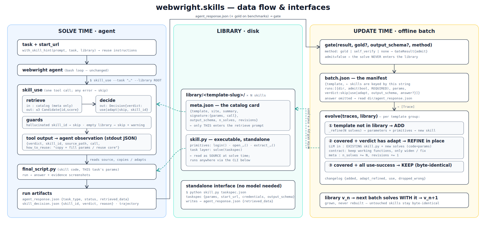

# `webwright.skills` — a memory / skill-library module for Webwright

**Most "agent skills" are notes the model reads. Ours are programs.**

With webwright.skills, each solved task becomes runnable, parameterized code — you can verify
it, run it without the model, and import it into the next task instead of re-exploring.



**Why webwright makes this natural.** Webwright is a terminal/code-native agent: its actions
are code, and every solve already leaves behind a working script. The agent's exhaust is
already code — turning it into skills is a byproduct, not an extra instrumentation layer.
It complements `crafted_cli`: where `crafted_cli` parameterizes a single task's script by
anticipating what might vary, `update.refine` parameterizes **across multiple verified
solves** — the differences actually observed between instances become the parameters.

**Validation-gated — exactly as strong as the gate you give it.** Every solve passes an
admission gate before it can enter the library. With gold answers (benchmarks — this is what
our WebArena numbers used) the gate is real supervision: wrong answers never get in. The
default `self_verify` gate only checks shape and non-emptiness — it filters garbage, **not
wrong-but-plausible answers**. Pass `--golds` to `learn`, or bring your own judge, when
correctness matters.

**One solve isn't a skill yet.** A single task's script is correct but narrow — it solves
*that* instance. So the update step aggregates multiple verified solves of the same task
template: values that differ across instances become parameters, patterns that recur become
shared primitives. The merged skill is often better than any single solve it came from —
different runs' strategies become fallbacks, and what settles into the library isn't a
click-path but the best algorithm the solves discovered (our commit-counting skill distilled
UI exploration into `git clone + git log`).

**The library keeps growing — safely.** A self-evolving loop feeds later solves back in: new
templates add skills, new solves refine existing ones in place (working functions kept), and
skills with nothing new stay byte-identical. Growth never breaks what already works.

**What you get, measured** (WebArena, 10 templates × 3 sites, held-out instances):

- **Tasks that were unsolvable become solvable** — from-scratch failed, with the library
  solved (4 rescues out of 20).
- **Tasks that were expensive become cheap** — 33 steps → 10 on repeat task types; overall
  70% vs 55% accuracy, ~2.4 fewer steps.

These numbers aren't take-our-word-for-it: [`evals/webarena/`](../../../evals/webarena/)
has the per-task records behind the table (aggregate them with one command, no setup) and
a driver that re-runs the whole experiment on your own WebArena deployment.

**Cheap to adopt, honest about costs.** Integration is purely additive — one tool plus one
CLI, no agent-loop changes. Building the library is not free, but close: it recycles solves
you already ran (only the gate-passed ones), plus one distillation LLM call per template
batch. Independently reproduced from a fresh clone in ~25 minutes.

## How it plugs into Webwright

Two touch points, **no change to the agent loop or default config**:

1. **Reuse at solve time — the `skill_use` tool.** The agent invokes it from bash, exactly like
   `self_reflection` / `image_qa`:
   ```bash
   python -m webwright.tools.skill_use --task "<the task>" --library "$SKILL_LIBRARY_ROOT"
   ```
   It returns JSON `{verdict: use|adapt|skip, skill_id, source_path, how_to_reuse}`. The agent
   reads `source_path` and reuses the skill (use = as-is, adapt = reuse core + change last step,
   skip = solve from scratch). `webwright.skills.with_skill_hint(prompt, ...)` prepends a one-line
   usage hint to the task prompt so the agent remembers to query the library first.

2. **Growth after solving — the `update` CLI.** Distill a batch of gate-passed solves into a
   library skill (offline, not in the solve loop):
   ```bash
   python -m webwright.skills.update --manifest batch.json --library ./library
   ```
   Friendly path: see **Quickstart**. Manifest schema and full control: **Manual mode** below.

> **Want to see it before reading?** `examples/` ships a real skill exactly as `evolve` wrote it
> (runnable standalone, no LLM), measured step-saving numbers, and filled-in example inputs for
> every file this guide asks you to write. See [`examples/README.md`](examples/README.md).

## Quickstart — the complete loop on Webwright's own example task

Three steps: solve a few instances of a task type, `learn` them into a skill, then watch
the next solve reuse it. The task family is the one from Webwright's main README —
Google Flights — where the answer is live (no model can recall it) and the UI is genuinely
fiddly, so a learned skill has something real to carry:

```bash
export OPENAI_API_KEY=...
# custom / OpenAI-compatible gateway? ALL steps need these too, or reuse is silently off:
export OPENAI_ENDPOINT=https://your-gateway/...   OPENAI_MODEL=your-model
cd src/webwright/skills    # commands below run from the module directory

# 1. SOLVE a few instances of the same task type (library is empty — these run from scratch)
while IFS='|' read -r FROM TO; do
  examples/solve_with_library.sh \
    "What is the cheapest flight from $FROM to $TO on 2026-08-15 (one-way)? Return the answer as a list: [airline, price]." \
    https://www.google.com/flights "$PWD/library" -o outputs -c base.yaml -c model_openai.yaml
done <<'ROUTES'
Seattle (SEA)|New York (JFK)
San Francisco (SFO)|Boston (BOS)
Los Angeles (LAX)|Chicago (ORD)
ROUTES

# 2. LEARN: distill everything you've solved into skills — no manifest, no fields to fill
python -m webwright.skills learn outputs/ --library ./library
# -> groups the 3 runs into ONE template and lifts FIVE parameters:
#    origin city/code, destination city/code, date
#    library/what_is_the_cheapest_flight_from_origin_.../{skill.py, meta.json}

# 3. USE the library: same wrapper, an UNSEEN route — the agent finds and reuses the skill
examples/solve_with_library.sh \
  "What is the cheapest flight from Seattle (SEA) to Denver (DEN) on 2026-08-15 (one-way)? Return the answer as a list: [airline, price]." \
  https://www.google.com/flights "$PWD/library" -o outputs -c base.yaml -c model_openai.yaml
# outputs/<run>/skill_decision.json -> {"verdict": "use", "skill_id": "what_is_the_cheapest_..."}
```

The library is also usable **without the agent** — this is the whole point of code skills:

```bash
# ask it whether it can help a task (the same call the agent makes — one LLM round trip)
python -m webwright.tools.skill_use \
  --task "cheapest flight from Portland (PDX) to Austin (AUS) on 2026-09-01" \
  --library ./library

# or run the learned skill directly — no model in the loop, ~30 seconds
cat > taskspec.json <<'EOF'
{"params": {"origin_city": "Seattle", "origin_code": "SEA", "destination_city": "Denver",
            "destination_code": "DEN", "date": "2026-08-15"},
 "output_schema": {"type": "array", "items": {"type": "string"}}}
EOF
python library/what_is_the_cheapest_flight_*/skill.py taskspec.json
# -> {"retrieved_data": ["Frontier", "$68"]}   (live price — yours will differ)
```

**What each way of running it actually costs** — the same unseen route (SEA→DEN), measured
minutes apart:

|                | from scratch | with the library | the skill, standalone |
|----------------|--------------|------------------|-----------------------|
| steps          | 17           | 15 (verdict `use`) | — (no agent)         |
| tokens         | ~378k        | ~407k            | **0**                 |
| wall time      | 8.9 min      | **5.2 min**      | **32 s**              |
| answer         | Frontier $68 | Frontier $68     | Frontier $68          |

Read it honestly: on a site the model already knows, a single reuse saves **wall time**
(exploration steps load pages and ship them to the model; reuse steps run known code), not
steps or tokens — reading the skill source costs context. The economics live in the last
column: **every repeat after the first runs with no model at all.** A fare watcher in cron
pays ~9 minutes and ~380k tokens once, then ~30 s and $0 forever. (On unfamiliar sites the
per-solve gap opens up too — see the WebArena numbers above: 33→10 steps, wrong→correct.)

**Verification on live data, honestly:** flight prices have no fixed gold answer, so the
gate here is `self_verify` (shape only — the run-time warning tells you so). What the table
DOES verify: three independent paths to the same answer, minutes apart. When your task
family has golds, pass `--golds` and admission becomes real verification.

Exactly this loop, already run and checked in: `examples/learned_library/` (provenance in
`examples/README.md`).

`learn` scans the run folders, gates each solve (gold if you pass `--golds golds.json`,
else a shape check), auto-groups tasks into templates with one LLM call per ~25 runs,
extracts the parameters, and grows the library. It is **idempotent** — re-run it whenever;
already-learned runs are skipped (`library/.learned.json`), and big folders are chunked
automatically. `--dry-run` shows the grouping plan without changing anything.
Everything below is **manual mode** — explicit manifests, benchmark-grade gold gates, fine
control over every field. You don't need it to get started.

**Where this fits:**
- *recurring personal queries* — releases, commit counts, price checks: pay the exploration
  once, every repeat is cheap (or free — run the skill standalone from cron, no model);
- *same-template batch jobs* — QA flows, report pulls: solve 3, learn, run the rest on skills;
- *a team library* — commit `./library` to your repo; everyone's agent reuses it.

## Manual mode: full control (end-to-end)

The library grows **offline** from batches of solved tasks, and is consumed **at solve time** by
the agent. Tasks are provided **manually** today — you pick which tasks to solve and batch. The
current focus is **same-template generalization**, so feed several instances of the SAME template
(3+ instances with different parameter values works well): `refine` aligns them, and exactly what
differs between instances becomes the skill's parameters — more instances, wider generalization.
(Planned: bootstrap — automatically expand one seed task into multiple instances.)

### 1. Solve a few instances of a template (normal Webwright runs)

**Important:** stock Webwright does NOT write the answer to a machine-readable file by itself —
tell the agent to, by appending an output instruction to the task (the gate in step 2 reads it):

```bash
ANSWER_SPEC='Additionally, write the final answer into $WORKSPACE_DIR/agent_response.json
as {"retrieved_data": <the answer, as a JSON list>}.'

python -m webwright.run.cli main \
  -t "How many commits did kilian make to a11yproject on 3/1/2023? $ANSWER_SPEC" \
  --task-id t132_a --start-url http://gitlab.example.com -o outputs \
  -c base.yaml -c model_openai.yaml
```

> Custom OpenAI-compatible gateway? Copy `model_openai.yaml`, change `openai_endpoint`
> (and `model_name`), and stack your copy instead.

Each run leaves a directory containing `final_script.py` (the executable solve) and — because of
the instruction above — `agent_response.json` (the answer). Repeat for 2–3 more instances of the
same template with different values (another user / repo / date). If you skip the output
instruction, fill each manifest run's `answer` field by hand in step 2 instead.

### 2. Gate the solves, write the manifest

Judge each run (`gate(result, method="gold")` against a known answer, or `method="self_verify"`
without one) and write one manifest per batch:

```jsonc
// batch.json
{
  "template": "How many commits did {{user}} make to {{repo}} on {{date}}?",
  "runs": [
    {
      "dir": "outputs/t132_a_20260703_120000",   // run dir; final_script.py is read from it
      "admit": true,                             // gate verdict — false rows NEVER enter the library
      "params": {"user": "kilian", "repo": "a11yproject", "date": "3/1/2023"},
      "verdict": "skip",                         // how the run used the library: skip = solved from
                                                 // scratch; use / adapt = reused a skill
                                                 // (adapt triggers refine-back into the skill)
      "site": "gitlab",
      "output_schema": {"type": "number"}        // required shape of retrieved_data
      // "answer": optional — read from the run dir's agent_response.json when omitted
    },
    { "dir": "outputs/t132_b_20260703_121500", "admit": true,
      "params": {"user": "gao", "repo": "2019", "date": "4/6/2023"},
      "verdict": "skip", "site": "gitlab", "output_schema": {"type": "number"} }
  ]
}
```

Field by field:

| field | required | meaning |
|---|---|---|
| `template` | yes | the template sentence with `{{param}}` placeholders. **Skills are keyed by it**: a manifest whose template already has a skill refines that skill in place; a new template adds a new skill. Use the same string across batches of the same template. |
| `runs[].dir` | yes | a Webwright run directory; `final_script.py` is read from it |
| `runs[].admit` | yes | the gate verdict; `false` rows are dropped and never enter the library |
| `runs[].params` | yes | this instance's concrete values — `refine` aligns the runs and exposes exactly these differing values as the skill's arguments (this is what powers generalization) |
| `runs[].verdict` | no (default `skip`) | how this run used the library: `skip` = solved from scratch; `use` = reused a skill as-is; `adapt` = reused + fixed the last step (**`adapt` is what triggers refining the fix back into the skill**) |
| `runs[].site` | no | site tag stored in the skill's meta (helps retrieval) |
| `runs[].output_schema` | no | required shape of `retrieved_data`, e.g. `{"type": "number"}` |
| `runs[].answer` | no | this run's answer; read from the run dir's `agent_response.json` when omitted |

### 3. Build / evolve the library

```bash
export OPENAI_API_KEY=...                        # backend key (never stored by the module)
# optional — defaults to OPENAI_MODEL / OPENAI_ENDPOINT:
export SKILL_MODEL_NAME=gpt-5.4 SKILL_MODEL_ENDPOINT=https://api.openai.com/v1/responses
python -m webwright.skills.update --manifest batch.json --library ./library
```

Prints a changelog: `{"added": [...], "adapt_refined": [...], "use": [...], "dropped_wrong": n}`.
Re-run with later batches any time — a new template **adds** a skill, new solves for an existing
template **refine it in place** (keeps its working functions), templates with no new traces are
left untouched. Batches may mix templates.

### 4. Reuse at solve time

```python
from webwright.skills import with_skill_hint
prompt = with_skill_hint(prompt, task=task_text, library="/abs/path/to/library")
```

```bash
python -m webwright.run.cli main -t "$prompt" ...
```

The hint tells the agent to query the library first; the agent runs the `skill_use` tool, gets
`{verdict, skill_id, source_path, how_to_reuse}`, reads the skill source, and reuses it
(use = as-is with new parameter values, adapt = reuse the core + change the last step,
skip = solve from scratch).

Two path gotchas, both loud now but worth knowing:

- **The library path ends up in a command that runs inside the agent's workspace** —
  `with_skill_hint` resolves it to an absolute path for exactly that reason. If the tool is ever
  pointed at a missing/empty library anyway, it answers `skip` with an explicit
  `"warning": "library empty at <abspath>"` instead of failing silently.
- **Precedence:** the hint bakes `--library` into the command, and `--library` beats the
  `SKILL_LIBRARY_ROOT` env var (the env var is only the tool's default when `--library` is
  omitted). Use one or the other, not both.

### 5. Run a skill directly (optional)

Every skill is also a standalone script: it reads a `taskspec.json` (parameters at run time) and
writes `agent_response.json`:

```bash
cat > taskspec.json <<'EOF'
{"params": {"user": "byte", "repo": "empathy-prompts", "date": "4/2/2023"},
 "start_url": "http://gitlab.example.com", "credentials": null,
 "output_schema": {"type": "number"}}
EOF
python library/how_many_commits_did_user_make_to_repo_on_date/skill.py taskspec.json
cat agent_response.json
```

### 6. The whole pipeline in one go (a batch of tasks)

Steps 1–3 driven by a single task file. `tasks.json` — one entry per instance of the template
(`gold` is optional; with it the gate compares answers, without it it falls back to `self_verify`):

```json
[
  {"id": "t132_a", "task": "How many commits did kilian make to a11yproject on 3/1/2023?",
   "params": {"user": "kilian", "repo": "a11yproject", "date": "3/1/2023"}, "gold": 1},
  {"id": "t132_b", "task": "How many commits did gao make to 2019 on 4/6/2023?",
   "params": {"user": "gao", "repo": "2019", "date": "4/6/2023"}, "gold": 0}
]
```

```bash
START_URL=http://gitlab.example.com

# 1) solve every instance (sequential; add xargs -P N or & to parallelize)
#    ANSWER_SPEC (from step 1 above) makes the agent write agent_response.json — the gate reads it
ANSWER_SPEC='Additionally, write the final answer into $WORKSPACE_DIR/agent_response.json
as {"retrieved_data": <the answer, as a JSON list>}.'
jq -c '.[]' tasks.json | while read -r row; do
  python -m webwright.run.cli main -t "$(jq -r .task <<<"$row") $ANSWER_SPEC" \
    --task-id "$(jq -r .id <<<"$row")" --start-url "$START_URL" -o outputs \
    -c base.yaml -c model_openai.yaml
done

# 2) gate each run + assemble the manifest
python - <<'PY'
import json, glob
from webwright.skills import gate

TEMPLATE = "How many commits did {{user}} make to {{repo}} on {{date}}?"
SCHEMA = {"type": "number"}
runs = []
for t in json.load(open("tasks.json")):
    d = sorted(glob.glob(f"outputs/{t['id']}_*"))[-1]        # newest run dir of this task
    answer = json.load(open(f"{d}/agent_response.json"))["retrieved_data"]
    g = gate(answer, gold=t.get("gold"), output_schema=SCHEMA)   # gold if present, else self_verify
    runs.append({"dir": d, "admit": g.admit, "params": t["params"], "verdict": "skip",
                 "site": "gitlab", "output_schema": SCHEMA})
json.dump({"template": TEMPLATE, "runs": runs}, open("batch.json", "w"), indent=2)
print(sum(r["admit"] for r in runs), "of", len(runs), "admitted")
PY

# 3) evolve the library
python -m webwright.skills.update --manifest batch.json --library ./library

# 4) solve NEW instances of the template WITH the library: prepend the skill hint
#    (the hint is what tells the agent to query; with_skill_hint resolves ./library
#     to an absolute path against YOUR cwd, so the agent finds it from its workspace)
TASK="How many commits did byte make to empathy-prompts on 4/2/2023?"
PROMPT=$(python -c 'import sys; from webwright.skills import with_skill_hint
print(with_skill_hint(sys.argv[1], task=sys.argv[1], library="./library"))' "$TASK")
python -m webwright.run.cli main -t "$PROMPT" \
  --task-id t132_new --start-url "$START_URL" -o outputs -c base.yaml -c model_openai.yaml
```

Repeat 1–3 whenever a new batch of solves lands — the library evolves in place (new templates are
added, existing skills are refined, untouched skills stay as they are). This is exactly the loop
our WebArena evaluation runs (train → gate → update → held-out reuse).

## Components

| file | role |
|---|---|
| `library.py`  | `Skill` + `Library(root)`: on-disk skills (`<id>/skill.py` + `meta.json`) |
| `retrieve.py` | `retrieve(task, library)` → ranked `Candidate`s (relevance) |
| `decide.py`   | `decide(task, candidates)` → `Decision(verdict, skill_id, reason)` (utility: use/adapt/skip) |
| `gate.py`     | `gate(result, method=gold\|self_verify\|none)` → admit? (keeps wrong solves out) |
| `update.py`   | `evolve(traces, library)`: grow on the existing library — add / adapt-refine / keep; `_refine` parameterizes + decomposes into primitives, incrementally improving an existing skill |
| `llm.py`      | `configure_llm(model)` + `llm()`: **backend-agnostic** via Webwright's `Model` abstraction; a bare CLI builds the model from `SKILL_MODEL_NAME`/`SKILL_MODEL_ENDPOINT` (or `OPENAI_*`) env — no hardcoded endpoint/key |
| `prompt.py`   | `with_skill_hint(prompt, task, library)`: non-invasive task-prompt hint |

## Gate

`gate(method=...)` is the **admission** check (independent of the solving agent — not the same as
`self_reflection`, which is the agent's own completion condition):
- `gold` — compare against a known answer (benchmarks); strongest.
- `self_verify` — invariant only (non-empty + shape); weak placeholder when no gold exists. It does
  not check *correctness*. Note: `self_reflection` cannot serve as the gate — `require_self_reflection_success`
  makes it always `predicted_label==1`, so it would admit everything (agent grading itself).
- `none` — admit all (demos).

## Backend

Backend-agnostic. Either `configure_llm(model_config_or_Model)` once in-process, or set
`SKILL_MODEL_NAME` / `SKILL_MODEL_ENDPOINT` (falling back to `OPENAI_*`) so a bare tool invocation
uses the same backend as the running agent. No gateway or key is hardcoded.

## Results (summary)

Validated with this module. Reproducible: [`evals/webarena/`](../../../evals/webarena/) ships
the per-task records these summaries aggregate from (`reproduce.py table --results results`)
plus the driver to re-run everything; CI locks the records to the numbers below.

- **WebArena — 10 templates × 3 domains (shopping_admin / gitlab / map), gold gate.** Per template
  3 train solves build the library, 2 held-out instances measure reuse (WITH library vs from
  scratch): held-out **70% vs 55% accuracy (+15pp), 14.7 vs 17.1 steps**; train 86% vs 76%.
  4 held-out tasks unsolvable from scratch are solved with the library; net reuse-wins 7 : 1
  regression. Largest saving: 33 steps → 10.
- **Retrieval stays reliable as the library grows:** all 20 held-out solves picked the correct
  skill from the shared library (grown to 10 skills), including telling apart two near-duplicate
  commit-counting skills.
- **Mixed-template batches evolve safely:** mixed batches add new templates, refine existing
  skills in place, and leave skills with no new traces byte-identical — zero cross-contamination;
  held-out reuse against a mixed-built library matches the per-template-built one.
- **Incremental growth:** a later batch improves the existing skill in place (keeps the working
  functions, adds robustness) rather than rewriting it.
- **Gate prevents pollution:** wrong solves (7 of 30 train) are dropped and never enter the library.
- **Real website (public GitHub, read-only):** end-to-end loop works — two repos solved from
  scratch → `update` distilled a parameterized skill → a held-out repo solved by reusing it
  (agent called `skill_use`, verdict `use`, answer correct).
- **Reuse value is task-dependent:** step savings are modest on easy tasks (query overhead ≈ the
  exploration it saves) and larger on harder tasks with more exploration to skip.
